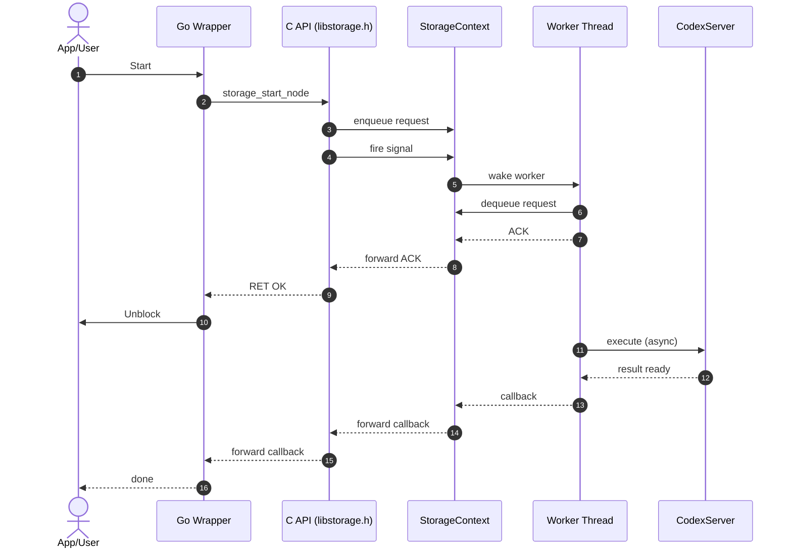

# Logos Storage Library

Logos Storage exposes a C binding that serves as a stable contract, making it straightforward to integrate Logos Storage into other languages such as Go.

The implementation was inspired by [nim-library-template](https://github.com/logos-co/nim-library-template)  
and by the [nwaku](https://github.com/waku-org/nwaku/tree/master/library) library.

The source code contains detailed comments to explain the threading and callback flow.  
The diagram below summarizes the lifecycle: context creation, request execution, and shutdown.



## C API

C-exported interface for the Logos Storage shared library.

This API provides a C-compatible interface to the internal Nim implementation of Logos Storage.

Unless explicitly stated otherwise, all functions are asynchronous and execute their work on a separate thread, returning results via the provided callback. The `int` return value is the synchronous status of dispatch:
- `RET_OK`: job dispatched to the worker thread
- `RET_ERR`: immediate failure
- `RET_MISSING_CALLBACK`: callback is missing

Some functions may emit progress updates via the callback using `RET_PROGRESS`, and finally complete with `RET_OK` or `RET_ERR`.  

The `msg` parameter can carry different kinds of data depending on the return code:

- If ret is `RET_ERR`, msg contains an error message.
- If ret is `RET_OK`, msg contains the response data as a string.
- If ret is `RET_PROGRESS`, msg contains a chunk of data.

The `len` parameter specifies the length of the data pointed to by msg.

---

## Types

### `StorageCallback`

```c
typedef void (*StorageCallback)(int callerRet, const char *msg, size_t len, void *userData);
```

---

## Return codes

```c
#define RET_OK 0
#define RET_ERR 1
#define RET_MISSING_CALLBACK 2
#define RET_PROGRESS 3
```

---

## Context lifecycle

### `storage_new`

Create a new instance of a Logos Storage node.

```c
void *storage_new(
    const char *configJson,
    StorageCallback callback,
    void *userData
);
```

- `configJson`: JSON string with configuration overwriting defaults
- Returns an opaque context pointer used for subsequent calls

Typical usage:
- `storage_new(...)`
- `storage_start(...)`
- `storage_stop(...)`
- `storage_destroy(...)`

---

### `storage_start`

Start the Logos Storage node (can be started/stopped multiple times).

```c
int storage_start(void *ctx, StorageCallback callback, void *userData);
```

---

### `storage_stop`

Stop the Logos Storage node (can be started/stopped multiple times).

```c
int storage_stop(void *ctx, StorageCallback callback, void *userData);
```

---

### `storage_close`

Close the node and release resources before destruction.

```c
int storage_close(void *ctx, StorageCallback callback, void *userData);
```

---

### `storage_destroy`

Destroy the node instance and free associated resources. Node must be stopped and closed.

```c
int storage_destroy(void *ctx, StorageCallback callback, void *userData);
```

---

## Version

### `storage_version`

Get the Logos Storage version string.
Does not require the node to be started and does not involve a thread call.

```c
int storage_version(void *ctx, StorageCallback callback, void *userData);
```

---

### `storage_revision`

Get the Logos Storage contracts revision.
Does not require the node to be started and does not involve a thread call.

```c
int storage_revision(void *ctx, StorageCallback callback, void *userData);
```

---

### `storage_repo`

Get the repo (data-dir) used by the node.

```c
int storage_repo(void *ctx, StorageCallback callback, void *userData);
```

---

## Debug

### `storage_debug`

Retrieve debug information (JSON).

```c
int storage_debug(void *ctx, StorageCallback callback, void *userData);
```

---

### `storage_spr`

Get the node's Signed Peer Record (SPR).

```c
int storage_spr(void *ctx, StorageCallback callback, void *userData);
```

---

### `storage_peer_id`

Get the node's peer ID (libp2p Peer Identity).

```c
int storage_peer_id(void *ctx, StorageCallback callback, void *userData);
```

---

### `storage_peer_debug`

Request debug information for a given peer ID.
Only available if compiled with `storage_enable_api_debug_peers`.

```c
int storage_peer_debug(void *ctx, const char *peerId, StorageCallback callback, void *userData);
```

---

## Logging

### `storage_log_level`

Set the log level at run time.
`logLevel` can be: `TRACE`, `DEBUG`, `INFO`, `NOTICE`, `WARN`, `ERROR`, `FATAL`.

```c
int storage_log_level(
    void *ctx,
    const char *logLevel,
    StorageCallback callback,
    void *userData
);
```

---

## Networking

### `storage_connect`

Connect to a peer by using `peerAddresses` if provided, otherwise use `peerId`.

Note that the `peerId` has to be advertised in the DHT for this to work.

```c
int storage_connect(
    void *ctx,
    const char *peerId,
    const char **peerAddresses,
    size_t peerAddressesSize,
    StorageCallback callback,
    void *userData
);
```

---

## Upload

### `storage_upload_init`

Initialize an upload session for a file.

- `filepath`: absolute path for file upload; for chunk uploads it's the file name. The metadata filename and mime type are derived from this value.
- `chunkSize`: chunk size for upload (default: `1024 * 64` bytes)
- Callback returns the `sessionId`

```c
int storage_upload_init(
    void *ctx,
    const char *filepath,
    size_t chunkSize,
    StorageCallback callback,
    void *userData
);
```

---

### `storage_upload_chunk`

Upload a chunk for the given `sessionId`.

```c
int storage_upload_chunk(
    void *ctx,
    const char *sessionId,
    const uint8_t *chunk,
    size_t len,
    StorageCallback callback,
    void *userData
);
```

---

### `storage_upload_finalize`

Finalize an upload session identified by `sessionId`.
Callback returns the `cid` of the uploaded content.

```c
int storage_upload_finalize(
    void *ctx,
    const char *sessionId,
    StorageCallback callback,
    void *userData
);
```

---

### `storage_upload_cancel`

Cancel an ongoing upload session.

```c
int storage_upload_cancel(
    void *ctx,
    const char *sessionId,
    StorageCallback callback,
    void *userData
);
```

---

### `storage_upload_file`

Upload the file defined as `filepath` in the init method.

- Callback may be called with `RET_PROGRESS` during upload (depending on chunk size constraints)
- Callback returns the `cid` of the uploaded content

```c
int storage_upload_file(
    void *ctx,
    const char *sessionId,
    StorageCallback callback,
    void *userData
);
```

---

## Download API

### `storage_download_init`

Initialize a download for `cid`.

- `chunkSize`: chunk size for download (default: `1024 * 64` bytes)
- `local`: attempt local store retrieval only

```c
int storage_download_init(
    void *ctx,
    const char *cid,
    size_t chunkSize,
    bool local,
    StorageCallback callback,
    void *userData
);
```

---

### `storage_download_stream`

Perform a streaming download for `cid`. Init must have been called prior.

- If `filepath` is provided, content is written to that file.
- Callback may be called with `RET_PROGRESS` updates during download.
- `local` indicates whether to attempt local store retrieval only.

```c
int storage_download_stream(
    void *ctx,
    const char *cid,
    size_t chunkSize,
    bool local,
    const char *filepath,
    StorageCallback callback,
    void *userData
);
```

---

### `storage_download_chunk`

Download a chunk for the given `cid`. Init must have been called prior.
Chunk returned via callback using `RET_PROGRESS`.

```c
int storage_download_chunk(
    void *ctx,
    const char *cid,
    StorageCallback callback,
    void *userData
);
```

---

### `storage_download_cancel`

Cancel an ongoing download for `cid`.

```c
int storage_download_cancel(
    void *ctx,
    const char *cid,
    StorageCallback callback,
    void *userData
);
```

---

### `storage_download_manifest`

Retrieve the manifest for the given `cid` (JSON).

```c
int storage_download_manifest(
    void *ctx,
    const char *cid,
    StorageCallback callback,
    void *userData
);
```

---

## Storage operations

### `storage_list`

Retrieve the list of manifests stored in the node.

```c
int storage_list(void *ctx, StorageCallback callback, void *userData);
```

---

### `storage_space`

Retrieve storage space information (JSON).

```c
int storage_space(void *ctx, StorageCallback callback, void *userData);
```

---

### `storage_delete`

Delete the content identified by `cid`.

```c
int storage_delete(void *ctx, const char *cid, StorageCallback callback, void *userData);
```

---

### `storage_fetch`

Fetch content identified by `cid` from the network into local store
in background. The callback will not receive progress updates.

```c
int storage_fetch(void *ctx, const char *cid, StorageCallback callback, void *userData);
```

---

### `storage_exists`

Check if content identified by `cid` exists in local store.

```c
int storage_exists(void *ctx, const char *cid, StorageCallback callback, void *userData);
```


### `storage_set_event_callback`

Not used currently. Reserved for future use to set an event callback.

```c
void storage_set_event_callback(void *ctx, StorageCallback callback, void *userData);
```

---

## Go wrapper

A Go wrapper is available [here](https://github.com/logos-storage/logos-storage-go-bindings).

## Rust Wrapper

A Rust wrapper is available [here](https://github.com/nipsysdev/codex-rust-bindings).